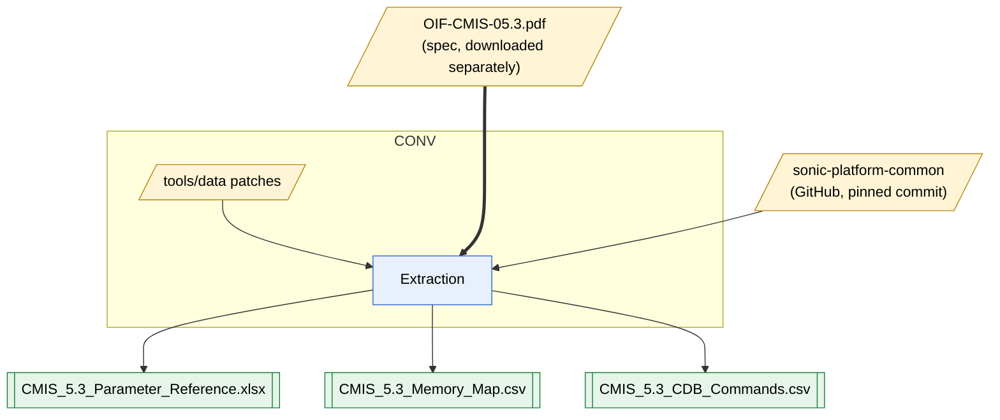

# CMIS 5.3 Parameter Reference

A field-level map of the OIF **Common Management Interface Specification (CMIS) 5.3** memory map
(Section 8), built for firmware work, test design and agent/code use.

| File | What it is |
|---|---|
| `CMIS_5.3_Parameter_Reference.xlsx` | Formatted workbook: **Read Me**, **Memory Map (Sec 8)** and **CDB Commands** (filters, header comments, frozen identity columns) |
| `CMIS_5.3_Memory_Map.csv` | Same Memory Map as plain text — use this for code, agents and diffs |
| `CMIS_5.3_CDB_Commands.csv` | The Section 9 CDB command list (ID, title, group, requirement, section, detail table) |
| `tools/` | Scripts that rebuild both files from the spec PDF, plus hand corrections and the SONiC field map |

Each row is one field (or reserved region) at one location: page, byte, length and bit mask, with
access, behavior, requirement, value type, the spec description and source table. Every row has a
unique **Key ID**. A **SONiC Cross-check** column compares each field with SONiC's
`sonic-platform-common` CMIS memory map at a pinned commit.

The workbook's **Read Me** sheet documents the conventions (blank = Lower Memory / whole byte /
unbanked / reserved, Key ID rule, per-lane expansion, DiagnosticsSelector conditions, scope).

## Source

OIF-CMIS-05.3 (4 Sept 2024): <https://www.oiforum.com/wp-content/uploads/OIF-CMIS-05.3.pdf>.
The PDF is not included in this repository; download it into the repository root to rebuild.
The specification is authoritative — verify timing- or safety-critical details against it.

## How it's built

## Rebuild

Requires Python 3 with `pdfplumber` and `openpyxl` (`pip install pdfplumber openpyxl`).
See [`tools/README.md`](tools/README.md). In short, from `tools/`:

    python3 extract_memory_map.py ../OIF-CMIS-05.3.pdf data/pdf_memory_map_raw.json
    python3 normalize_memory_map.py data/pdf_memory_map_raw.json data/memory_map.json
    python3 rebuild_memory_map.py ../CMIS_5.3_Parameter_Reference.xlsx
    python3 extract_cdb_commands.py ../OIF-CMIS-05.3.pdf data/cdb_commands.json
    python3 update_param_reference.py ../CMIS_5.3_Parameter_Reference.xlsx

Hand corrections (e.g. evident spec typos) go in `tools/data/corrections.csv`, keyed by location
with an expected-name guard, so they are re-applied on every rebuild.

## Not yet covered

CDB command payload field layouts (the command list is included); VDM page-range tables (pages 20h-2Bh); EPL pages A0h-AFh.

## License

The scripts in `tools/` and this repository's original work are released under the [MIT License](LICENSE).
Content derived from the OIF-CMIS-05.3 specification — field names, addresses, types and the
verbatim Description text in the workbook and CSV — remains © Optical Internetworking Forum and is
not covered by the MIT License. The SONiC field map in `tools/data/` is derived from
sonic-platform-common (Apache-2.0). See [LICENSE](LICENSE) for details.
